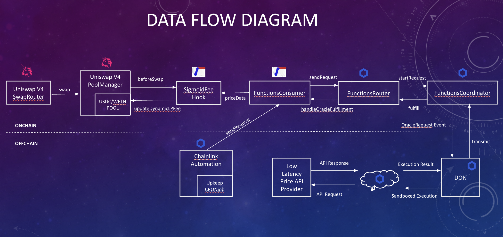

# Sigmoid Directional Fees Hook Implementation

## Dynamic Fee Curve: The Sigmoid S-Curve Model

For the dynamic fee curve, I've opted for a **Sigmoid s-curve model**. This model features:

- A **slow fee increase** for small discrepancies between the pool price and the oracle price.
- **Rapid exponential growth** as the discrepancy widens.
- A **cap at a maximum fee** for significant price differences.

### Sigmoid Curve Mathematical Expression

$$
\text{fee}(\Delta p) = c_0 + \frac{c_1}{1 + e^{c_2 \cdot (c_3 - \Delta p)}}
$$

Where $\Delta p$ represents the discrepancy between the pool price after a certain trade and the Binance price at the corresponding estimated timestamp.

### Curve Design Objectives

This curve design aims to:

- **Minimize impermanent loss (IL)** from arbitrageurs by keeping the fee delta negligible for small price discrepancies (since arbitrage is unlikely due to associated costs exceeding the profit).
- **Penalize users** swapping in the direction of arbitrage for larger discrepancies, without exceeding a **2x fee cap**.
- **Avoid deterring informed traders**, who would avoid pools with excessively high fees, thereby inadvertently penalizing uninformed traders who would be the only ones swapping in such adverse conditions.

The full dynamic fees curve explanation and backtesting can be found in this repository:  
[https://github.com/adsvferreira/univ3_usdc_weth_500_simulations](https://github.com/adsvferreira/univ3_usdc_weth_500_simulations)

### Hook Mechanism Description

As the main variable of the sigmoid directional fee model is the price delta between the pool and "global" efficient price, and the main goal of this project is to reduce the liquidity provider losses to arbitrageurs who take advantage of these relatively small discrepancies between consecutive blocks, regular Chainlink price feeds are not well suited for this use case due to their latency (especially on mainnet).

My workaround for this was the implementation of a custom oracle based on the prices retrieved by the CryptoCompare API using Chainlink Functions for fetching the data and Chainlink Automation to execute the request and save the data on-chain periodically with very low latency compared to price feeds.

**Custom Low Latency Oracle Sepolia Addresses:**

- **Chainlink Functions Consumer**: `0xddc2e9aae870617c91fa417809b14cfde4f76181`
- **Chainlink Automation Upkeep**: `0xC25f1055f9F8281cf60b1CEC7faD803d5F96e755`

This low latency oracle mechanism was successfully tested on the Sepolia testnet, as can be seen in the executed transactions. After testing, the Upkeep contract was paused to stop the testnet LINK consumption.

This oracle mechanism is a PoC for demonstrating the Sigmoid Directional Fees mechanism. In a production version, we should not rely on a single centralized API for getting prices but on a set of reliable APIs and add some logic besides the timestamp verification to verify if the price is valid (namely, compare the deviation of the prices from different sources and input the variance on-chain).

Even being a PoC, I've tried to make it as reliable as possible within the least development time. Thus, I'm using the regular Chainlink ETH/USD price feed as a fallback in case the custom oracle price gets stale. In the worst-case scenario, if the Chainlink price feed updated time also exceeds the defined timeout, the swap fee retrieved is simply the base fee.

### Data Flow Diagram


### Implementation Notes

As this curve was implemented as a smart contract and exponential calculations are gas-expensive, the fee value is only updated in the first swap of each block and remains the same for subsequent swaps within the same block. This implementation decision has a low impact on reducing arbitrage since effective arbitrage only happens at the top of the block due to high MEV searcher competition.

## Foundry

**Foundry is a blazing fast, portable and modular toolkit for Ethereum application development written in Rust.**

Foundry consists of:

- **Forge**: Ethereum testing framework (like Truffle, Hardhat and DappTools).
- **Cast**: Swiss army knife for interacting with EVM smart contracts, sending transactions and getting chain data.
- **Anvil**: Local Ethereum node, akin to Ganache, Hardhat Network.
- **Chisel**: Fast, utilitarian, and verbose solidity REPL.

## Documentation

https://book.getfoundry.sh/

## Usage

### Build

```shell
$ forge build
```

### Test

```shell
$ forge test
```

### Format

```shell
$ forge fmt
```

### Gas Snapshots

```shell
$ forge snapshot
```

### Anvil

```shell
$ anvil
```

### Deploy

```shell
$ forge script script/Counter.s.sol:CounterScript --rpc-url <your_rpc_url> --private-key <your_private_key>
```

### Cast

```shell
$ cast <subcommand>
```

### Help

```shell
$ forge --help
$ anvil --help
$ cast --help
```
